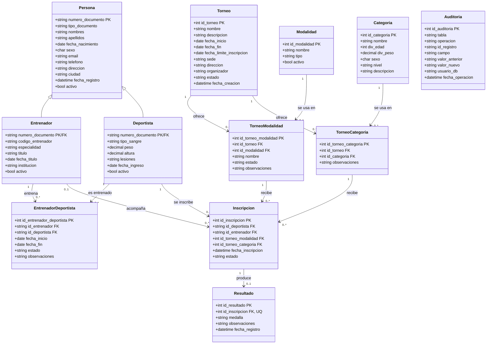

# GestionDeportiva — Diagrama de Clases (UML)

> Documentación del modelo de dominio para el sistema de gestión de torneos deportivos (v4, SQL Server). Base para el proyecto de práctica DevSecOps.

## Resumen del dominio

El sistema modela personas que pueden ser **Entrenadores** y/o **Deportistas** (patrón TPT sobre `Persona`), su relación de entrenamiento a lo largo del tiempo, y el ciclo de vida de un **Torneo**: modalidades, categorías, inscripciones y resultados.

---

## Diagrama de clases completo

---

## Notas de diseño

### Herencia TPT (Table-per-Type)
`Entrenador` y `Deportista` comparten la PK con `Persona` (relación 1:1 vía `numero_documento`). Una persona puede ser ambas cosas a la vez — el modelo no las trata como mutuamente excluyentes.

### Entidad histórica: `EntrenadorDeportista`
No es una simple tabla puente: tiene `fecha_inicio`/`fecha_fin`/`estado` porque la misma pareja entrenador-deportista puede tener varios períodos de relación a lo largo del tiempo. Requiere PK surrogate propia por esta razón.

> [!warning] Gap de integridad — períodos solapados
> Nada en el esquema actual impide dos filas para el mismo par `id_entrenador`/`id_deportista` con `fecha_inicio`/`fecha_fin` que se superpongan. Si eso es un caso inválido en el dominio (un deportista no debería tener dos entrenadores activos al mismo tiempo, por ejemplo), hace falta un **trigger** que valide no-solapamiento en `INSERT`/`UPDATE` — siguiendo el mismo estilo de triggers que ya se viene usando en el resto del proyecto.

### `Inscripcion` vs `Resultado`
Se separan deliberadamente porque ocurren en momentos distintos del ciclo de vida del torneo:
- `Inscripcion` nace **antes** de competir.
- `Resultado` nace **después**, y depende 1:0..1 de una inscripción (una inscripción puede no tener resultado aún, pero nunca dos).

`Resultado` no tiene FK directa a `Torneo`, `Deportista` ni `Categoria` — esa información se navega vía `Resultado → Inscripcion → resto del modelo`. Duplicar esas FK violaría 3FN (ver [[DevSecOps-Proyecto/GestionDeportiva-Diccionario-Datos]] §11).

### Tabla de auditoría genérica: `Auditoria`
No tiene FK real hacia ninguna tabla — `id_registro` es un `varchar` genérico que guarda la PK de la fila auditada como texto, sin importar de qué tabla venga (patrón polimórfico). Por eso no aparece con una flecha de relación en el diagrama de clases: la "relación" es solo convencional, resuelta en el trigger que la alimenta, no por una constraint de la base de datos. Actualmente solo `Persona` tiene un trigger de auditoría (`tr_AuditoriaPersona`, solo INSERT/DELETE) y `Entrenador` audita indirectamente el campo `activo` vía `tr_SuspenderRelacionesEntrenador`. Detalle completo, incluyendo un problema real de PII en texto plano, en [[DevSecOps-Proyecto/GestionDeportiva-Diccionario-Datos]] §14.

> [!danger] Bug confirmado en `UQ_Inscripcion_Unica`
> El índice único real incluye `id_Entrenador` (nullable). En SQL Server, `NULL` nunca es igual a `NULL` dentro de un índice único, así que un deportista sin entrenador asignado (`id_Entrenador = NULL`, un caso soportado explícitamente) puede quedar inscrito **más de una vez** en la misma combinación torneo/modalidad/categoría sin violar la constraint. No es solo un riesgo teórico — es un bug confirmado en el DDL real. Fix y detalle en [[DevSecOps-Proyecto/GestionDeportiva-Diccionario-Datos]] §10.

> [!warning] Gap de consistencia — `Inscripcion` con dos FKs a `Torneo` sin relación garantizada
> `Inscripcion` referencia `id_torneo_modalidad` y `id_torneo_categoria` por separado. El trigger `tr_ValidarEstadoTorneo` (nuevo, encontrado en el DDL) valida el estado del torneo, pero solo vía `TorneoModalidad` — nunca compara contra `TorneoCategoria`. El gap sigue sin cerrarse en el código real, no solo en el modelo. Dos formas de cerrarlo:
> 1. Trigger que valide `TorneoModalidad.id_torneo == TorneoCategoria.id_torneo` en cada inserción a `Inscripcion`.
> 2. Fusionar `TorneoModalidad` + `TorneoCategoria` en una única tabla `TorneoModalidadCategoria` con `id_torneo` una sola vez — más limpio si en la práctica cada torneo ofrece combinaciones fijas de modalidad+categoría.

### PK basada en documento de identidad
`numero_documento` como PK compartida es el patrón correcto para implementar TPT (necesita una PK 1:1 entre `Persona` y sus subtipos). El costo de este diseño es que la cédula —un dato personal— se propaga como FK a **todas** las tablas relacionadas (`EntrenadorDeportista`, `Inscripcion`, etc.), no solo a `Persona`. No implica cambiar el modelo, pero sí que la capa de API nunca debería devolver `numero_documento` crudo en respuestas ni loguearlo — usar un identificador interno o el `id_inscripcion`/`id_entrenador_deportista` como referencia pública en su lugar.

---

## Seguridad del modelo (DevSecOps)

| Campo / entidad | Tabla | Categoría de riesgo | OWASP Top 10:2025 | Mitigación al construir la API |
|---|---|---|---|---|
| `tipo_sangre`, `lesiones` | Deportista | Dato de salud | A04 Cryptographic Failures | Cifrado en reposo (column-level encryption o cifrado a nivel de aplicación antes de persistir) |
| `direccion`, `telefono`, `fecha_nacimiento` | Persona | Dato personal (Ley 1581) | A04 Cryptographic Failures | Cifrado en reposo; enmascarar en logs |
| `email` | Persona | Dato personal / identificador único | A04 Cryptographic Failures | No usar como identificador en URLs públicas; rate limiting en endpoints que lo consultan (enumeración de usuarios) |
| `numero_documento` | Persona (PK) | Dato personal, se propaga como FK a todo el modelo | A04 Cryptographic Failures | Nunca exponerlo crudo en respuestas de API ni en logs — ver nota de diseño arriba |
| `Resultado.medalla` | Resultado | Integridad de datos, no confidencialidad | A08 Software or Data Integrity Failures | Audit log de quién y cuándo registró/modificó un resultado; solo el rol Organizador/Admin debería poder escribirlo (ver [[DevSecOps-Estudio/Patrones/Anti-Patrones-Seguridad]] #3, Authentication sin Authorization) |
| Endpoints de inscripción | Inscripcion | Abuso / spam de inscripciones | A01 Broken Access Control | Autorización por rol + rate limiting (ver [[DevSecOps-Estudio/Patrones/Best-Practices]], sección Código) |
| `Auditoria.valor_nuevo`, `id_registro` | Auditoria | PII en texto plano — **confirmado en el DDL real** | A04 Cryptographic Failures | `tr_AuditoriaPersona` guarda `email` y `numero_documento` sin enmascarar; corregir el trigger para hashear o truncar esos valores antes de insertar (ver [[DevSecOps-Proyecto/GestionDeportiva-Diccionario-Datos]] §14) |

> [!tip] Conexión con el resto del vault
> Esta tabla sigue el mismo formato de "riesgo → categoría OWASP → mitigación" que [[DevSecOps-Estudio/Patrones/Best-Practices]] y [[DevSecOps-Estudio/Patrones/Anti-Patrones-Seguridad]]. Cuando diseñes la API sobre este esquema, esos dos documentos son la checklist a aplicar directamente sobre estos endpoints.

---

## Próximos pasos sugeridos

- [ ] **Prioridad alta:** corregir `UQ_Inscripcion_Unica` — quitar `id_Entrenador` del índice único (bug confirmado, ver nota de diseño)
- [ ] Enmascarar/hashear `email` y `numero_documento` en `tr_AuditoriaPersona` antes de escribir en `Auditoria`
- [ ] Agregar auditoría de `UPDATE` sobre `Persona` (actualmente solo INSERT/DELETE)
- [ ] Definir roles de aplicación (Deportista, Entrenador, Organizador/Admin) sobre este modelo
- [ ] Diagrama de casos de uso por rol
- [ ] Trigger de no-solapamiento en `EntrenadorDeportista`
- [ ] Trigger o rediseño para garantizar consistencia `Torneo` en `Inscripcion` (ver nota de diseño)
- [ ] Diseño de API (endpoints + autorización por recurso — `[Authorize(Roles = "Organizador")]` para escritura en `Resultado`)
- [ ] Pipeline CI/CD con SAST/SCA
- [ ] Definir qué campos se cifran en reposo y cuáles solo se enmascaran en logs (tabla de seguridad arriba)

## Referencia

- [[DevSecOps-Proyecto/GestionDeportiva-Diccionario-Datos]] — tipos exactos, CHECK constraints e índices únicos de cada tabla
- [[DevSecOps-Estudio/Patrones/Best-Practices]]
- [[DevSecOps-Estudio/Patrones/Anti-Patrones-Seguridad]]
- [[DevSecOps-Estudio/Seguridad/Bases-Datos-Vulnerabilidades]]

---
#database #uml #devsecops #gestion-deportiva #sql-server
